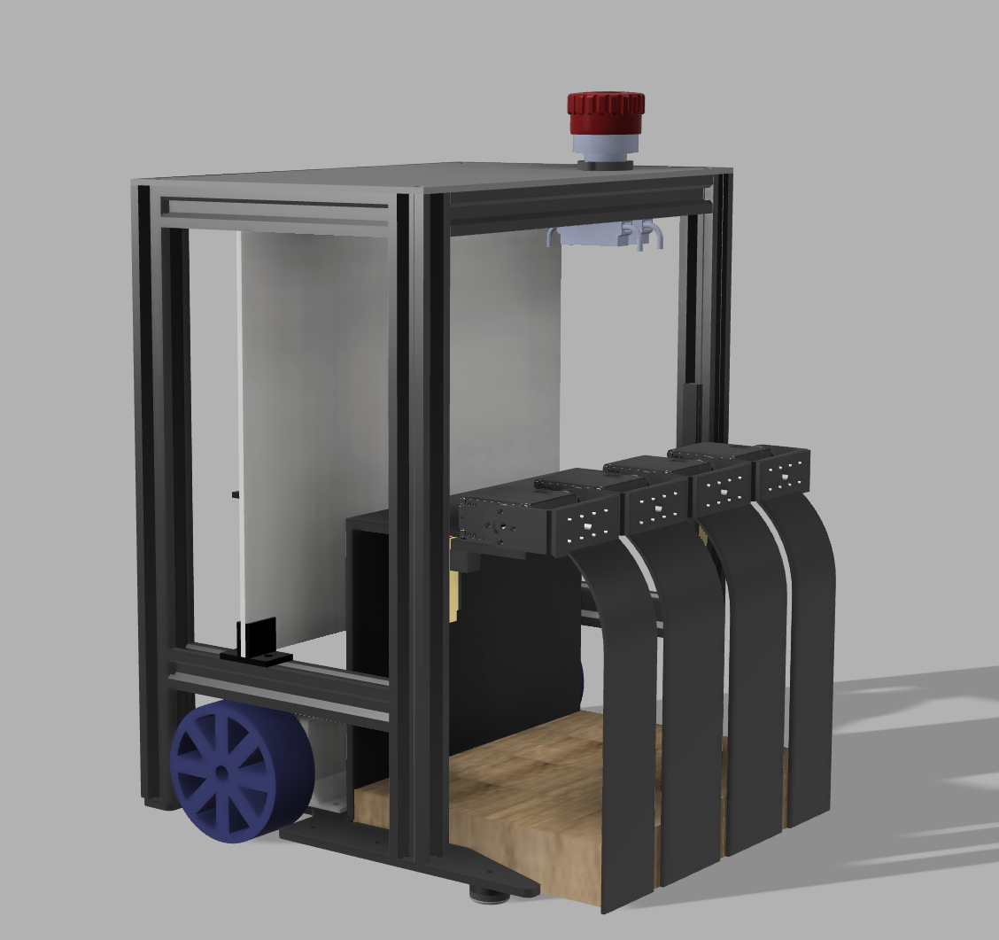

# Eurobot 2026


Differentialantrieb mit 2 Stepper-Motoren (ESP32 + TB6600), 8 STServos (Greifer + Mechanik), RPLIDAR, PiCamera2.

---

## Workflow

```
[Boot]  →  main.py startet automatisch (systemd)
                    ↓
[SSH]   →  python3 raspi/client.py   verbinden
                    ↓
           team blue          Team setzen
           tactic 1           Taktik wählen
           ready              Homing → warten auf Zugschnur → Spiel
                    ↓
[Zugschnur ziehen]  →  Spiel läuft 99 s  →  fertig
```

---

## client.py – Befehle

```
status / s              aktuellen Zustand anzeigen
team blue|yellow        Team setzen
tactic <n> / t <n>      Taktik wählen (1–4)
ready / r               Homing + auf Zugschnur warten + Taktik starten
home / h                nur Homing (kein Spielstart)
stop                    Notfall-Stopp
drive <mm> / d <mm>     Test: fahre mm vorwärts
turn <deg>              Test: drehe deg Grad
servo <id> <pos>        Test: Servo direkt setzen
gripper open|close|home / g o|c|h
help / ?                Befehlsübersicht
exit / q                Verbindung trennen
```

Server-Ausgaben sind farbkodiert: **grün** = OK, **rot** = ERR, **grau** = LOG.

---

## Autostart (systemd)

```bash
# Einmalig einrichten
sudo cp raspi/eurobot.service /etc/systemd/system/
sudo systemctl daemon-reload
sudo systemctl enable eurobot

# Steuerbefehle
sudo systemctl start|stop|restart eurobot
sudo systemctl status eurobot
journalctl -u eurobot -f        # Live-Log
```

---

## Hardware-Status prüfen

```bash
python3 raspi/status.py
```

Prüft alle Komponenten (ESP32, Servos, Lidar, Kamera, GPIO) ohne etwas zu bewegen.

---

## ESP32 flashen

```bash
cd ESP
pio run -t upload        # Port wird automatisch erkannt
pio device monitor       # Seriellen Monitor öffnen (115200 Baud)
```

---

## Taktiken anpassen

In `raspi/main.py` → `TACTICS`-Dict. Homing (`hg` + `hm`) wird automatisch
von `ready` davor ausgeführt und muss nicht in die Taktik.

Alle verfügbaren Aktionen: [`raspi/ACTIONS.md`](raspi/ACTIONS.md)

---

## Dateistruktur

```
ESP/                       ESP32 PlatformIO-Projekt (Stepper-Controller)
raspi/
  main.py                  Hauptprogramm (autonom, TCP-Server)
  client.py                CLI-Client (per SSH verbinden)
  status.py                Hardware-Status-Check (non-destructive)
  ACTIONS.md               Vollständige Aktions-Dokumentation
  eurobot.service          systemd-Unit-File
  eurobot.log              Laufzeit-Log
  modules/
    esp32.py               Serielle Kommunikation ESP32
    servos.py              STServo USB-Bus (8 Servos)
    gripper.py             Greifer-Sequenzen
    task.py                Aktions-Dispatcher
    lidar.py               RPLIDAR
    camera.py              PiCamera2 / ArUco
    STservo_sdk/           Waveshare/Feetech STS-Protokoll
PINOUT.md                  Vollständiges Hardware-Pinout
```

---

## Hardware

| Komponente | Verbindung |
|---|---|
| ESP32 (CP2102) | USB → Raspi |
| 2× TB6600 Stepper | PUL+/DIR+ an ESP32 GPIO 25/26 (links), 32/33 (rechts) |
| STServo Adapter (CH340) | USB → Raspi |
| 4× Frontgreifer | STServo Bus-IDs 2, 1, 11, 9 (links → rechts) |
| 2× Heben/Senken | Bus-IDs TODO |
| 2× Thermometer | Bus-IDs TODO |
| Zugschnur | GPIO 22 (Pull-Up, LOW = drin) |
| Team-Schalter | GPIO 17 (Pull-Up, LOW = Blau) |
